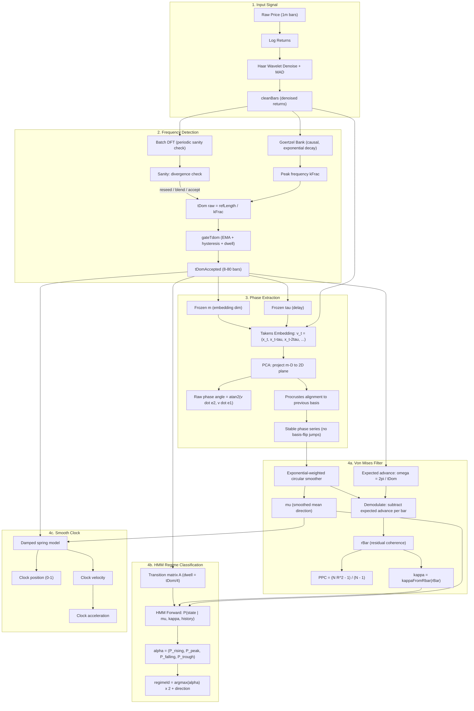
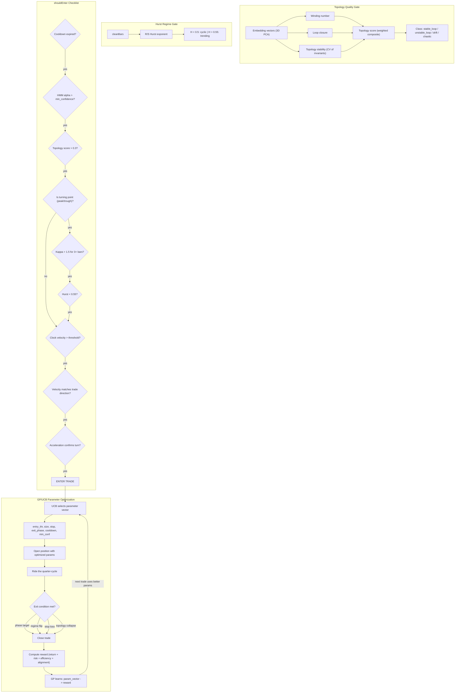

# SBN Pipeline Architecture

## Signal Processing Pipeline (Perception)

## Trading Decision Pipeline

## Key Numbers at Each Stage

- **Input**: ~2048 event bars max, 256 lookback for DFT
- **Frequency**: tDom range 8-80 bars (was 200, lowered to prevent cascade failure)
- **Embedding**: m=3-6 dimensions, tau=2-20 bars, span=(m-1)*tau bars
- **Phase window**: 2.5 x tDom bars of phase history
- **VM horizon**: 0.55 x tDom bars (exponential weighting)
- **HMM dwell**: tDom/4 bars per state minimum
- **Clock spring**: damping 0.93, max velocity 0.035 per bar
- **Trading**: 8 regime-specific GP models, 6 parameters each, UCB exploration
