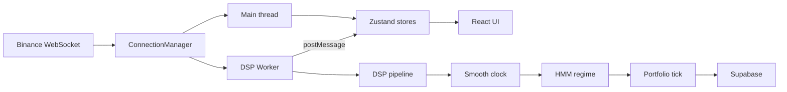

## High-level data flow

## Main thread

The main thread handles UI rendering, WebSocket management, and coherence history buffering.

**Key modules:**
- `ConnectionManager` -- manages dual-endpoint Binance WebSocket connections with health checks, reconnection, and failover.
- `useDspWorker` hook -- owns the Worker lifecycle, forwards prices to the worker, handles worker messages, and flushes coherence points to Supabase every 10 seconds.
- Zustand stores -- `price`, `analysis`, `portfolio`, `geometry`, `connection`, `settings`, `coherence-history`.

## Web Worker

All heavy DSP and trading computation runs off the main thread in `src/workers/dsp.worker.ts`.

**Processing pipeline per price tick:**

1. **OHLC aggregation** -- raw trade prices are aggregated into configurable-timeframe candles.
2. **Event-clock resampling** -- close prices are resampled into event bars.
3. **Raw analysis** -- wavelet denoising, sliding-window DFT, peak detection.
4. **Smooth analysis** -- Goertzel bank for dominant period tracking, time-delay embedding, von Mises concentration estimation.
5. **HMM regime classification** -- 4-state Hidden Markov Model (RISING, PEAK, FALLING, TROUGH) driven by phase angle.
6. **Portfolio tick** -- per-regime Gaussian Process UCB acquisition selects trade parameters; entry/exit signals drive paper trading.

**Persistence:** state is saved to Supabase every 5 seconds (fire-and-forget) including GP model states, portfolio snapshot, and smooth clock state.

## Persistence layer

All database operations go through `src/services/persistence/db.ts`, which provides async helpers that map between camelCase app types and snake_case Supabase columns.

| Table | Content | Write frequency |
| --- | --- | --- |
| `gp_states` | 8 rows of Gaussian Process model state | Every 5s |
| `portfolio` | Singleton trading state (equity, curves) | Every 5s |
| `trades` | Normalised closed trade records | Every 5s (with portfolio) |
| `smooth_state` | Singleton DSP clock/HMM state | Every 5s |
| `coherence_history` | Time-series coherence metrics (capped at 2000) | Every 10s |

## Pages and routes

Routes are file-based via TanStack Router under `src/app/routes/`:

| Route | Page |
| --- | --- |
| `/` | Dashboard (live analysis + charts) |
| `/analytics` | Detailed analytics views |
| `/backtest` | Backtesting interface |
| `/geometry` | Phase-space geometry visualisation |
| `/history` | Trade and coherence history |
| `/optimization` | GP optimisation explorer |
| `/settings` | User preferences |
| `/voxel` | 3D voxel density view |
