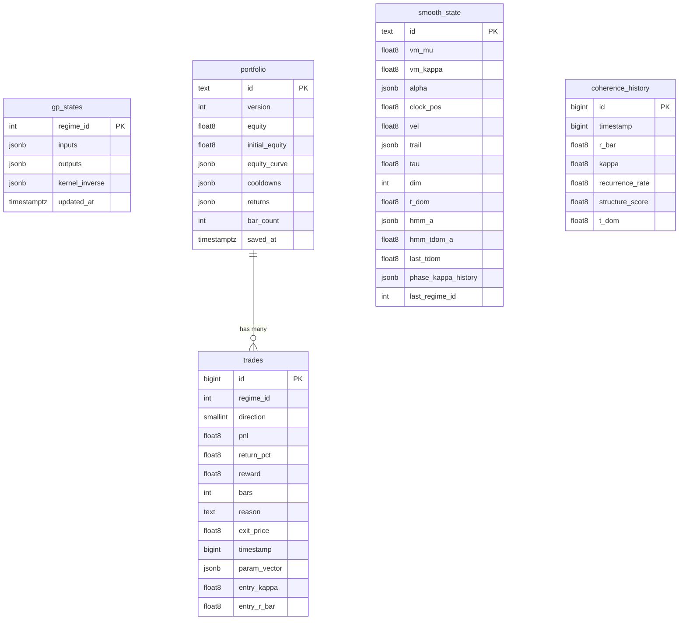

SBN uses Supabase Postgres for persisting trading state across sessions. All database operations go through `src/services/persistence/db.ts`.

## Schema

## Tables

### `gp_states`

Stores the state of 8 Gaussian Process models (one per regime). Each row contains the training inputs, outputs, and cached kernel inverse matrix.

Written every 5 seconds by the DSP worker via `saveGpStates()`.

### `portfolio`

Singleton row (`id = 'current'`) holding the current portfolio snapshot: equity, initial equity, equity curve, per-regime cooldowns, and return history.

### `trades`

Normalised closed trade records. Each trade records the regime, direction, P&L, exit reason, and the parameter vector that produced it. Indexed on `regime_id` and `timestamp`.

### `smooth_state`

Singleton row for the DSP smooth clock and HMM state: von Mises parameters, clock position/velocity, embedding trail, dominant period, HMM transition matrix, and phase-kappa history.

### `coherence_history`

Time-series of coherence metrics (rBar, kappa, recurrence rate, structure score, tDom). Capped at 2,000 rows with automatic pruning of the oldest entries. Indexed on `timestamp`.

## Write patterns

| Source | Tables | Frequency | Method |
| --- | --- | --- | --- |
| DSP worker | `gp_states`, `portfolio`, `trades`, `smooth_state` | Every 5s | Fire-and-forget upsert |
| Main thread | `coherence_history` | Every 10s | Batch insert + prune |

All writes are fire-and-forget (errors caught silently) so network latency does not block the worker or main thread.

## Environment variables

| Variable | Description |
| --- | --- |
| `VITE_SUPABASE_URL` | Supabase project URL |
| `VITE_SUPABASE_PUBLISHABLE_KEY` | Supabase publishable API key |
